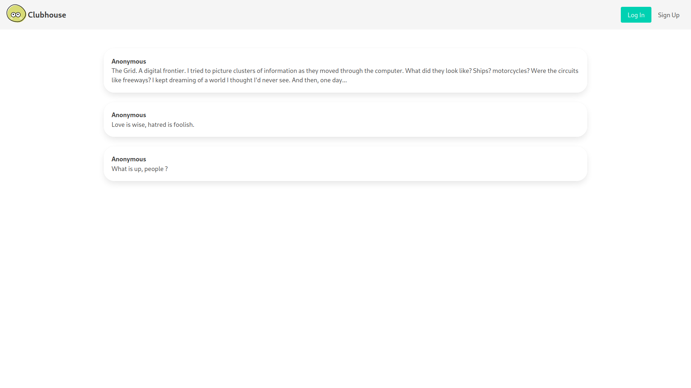
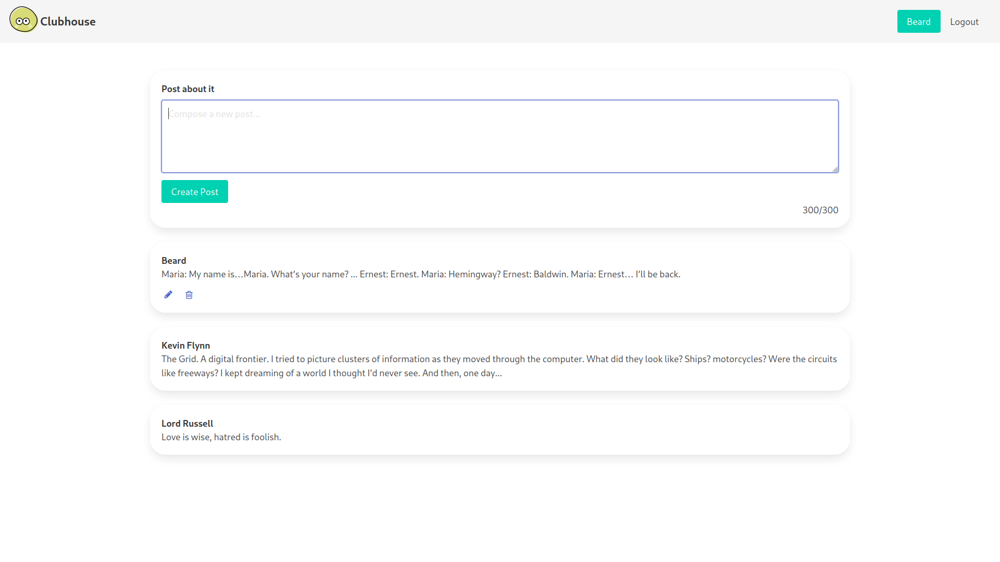

<h1 align="center" style="margin-top: 0px;">Clubhouse</h1>

Inside the clubhouse, members can see who the author of a post is but, outside, they can only see the story and wonder who wrote it.

</img> </img> 

### Overview:

The app itself features a basic user authentication and authorization system with help of [Devise](https://github.com/heartcombo/devise) gem.
Authorized users can make posts, edit and delete them. They are also able to see the authors of others posts. Users who are not signed up are able to see the posts but not the authors.

### Gems used:

- [Better Errors](https://rubygems.org/gems/better_errors) - for better errors.

- [Bulma](https://github.com/joshuajansen/bulma-rails) - CSS framework.

- [Guard](https://github.com/guard/guard) - automates various tasks.

- [Guard LiveReload](https://github.com/guard/guard-livereload) - allows to automatically reload your browser when 'view' files are modified.

- [Simple Form](https://github.com/plataformatec/simple_form) - for simple forms.

- [Devise](https://github.com/plataformatec/devise) - authentication and authorization system.

- [Inline SVG](https://github.com/jamesmartin/inline_svg)- adds Rails helper methods that read an SVG.

### Contact me:

vladyslav.kolomiets@protonmail.com

### Contributing:

Pull requests are welcome.
